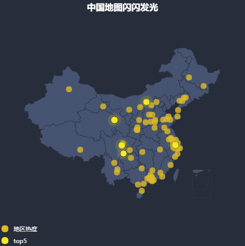

# vue+vuex+axios+echarts画一个动态更新的中国地图



## 一. 生成项目及安装插件

```
# 安装vue-cli
npm install vue-cli -g

# 初始化项目
vue init webpack china-map

# 切到目录下
cd china-map

# 安装项目依赖
npm install

# 安装 vuex
npm install vuex --save

# 安装 axios
npm install axios --save

# 安装 ECharts
npm install echarts --save
```

## 二. 项目结构
```
├── index.html
├── main.js
├── components
│   └── index.vue
└── store
    ├── index.js          # 组装模块及导出store的文件
    └── modules
        └── ChinaMap.js   # 中国地图Vuex模块
```

## 三. 引入中国地图并绘制基本的图表

1.按需求引入与中国地图相关的Echarts图表和组件。

```
// 主模块
let echarts = require('echarts/lib/echarts')
// 散点图
require('echarts/lib/chart/scatter')
// 散点图放大
require('echarts/lib/chart/effectScatter')
// 地图
require('echarts/lib/chart/map')
// 图例
require('echarts/lib/component/legend')
// 提示框
require('echarts/lib/component/tooltip')
// 地图geo
require('echarts/lib/component/geo')
```

2.引入中国地图JS文件，会自动注册地图；也可以通过axios方式引入json文件，需要**手动注册**`echarts.registerMap('china', chinaJson.data)`。

```
// 中国地图JS文件
require('echarts/map/js/china')
```

3.准备一个有固定宽高的DOM容器并在mounted里面初始化一个echarts实例。

DOM容器

```
<template>
  <div id="china-map"></div>
</template>
```

初始化echarts实例

```
let chinaMap = echarts.init(document.getElementById('china-map'))
```

4.设置初始化的空白地图，这里需要设置很多echarts参数，参考[ECharts配置项手册](http://echarts.baidu.com/option.html)。


```
chinaMap.setOption({
    backgroundColor: '#272D3A',
    // 标题
    title: {
      text: '中国地图闪闪发光',
      left: 'center',
      textStyle: {
        color: '#fff'
      }
    },
    // 地图上圆点的提示
    tooltip: {
      trigger: 'item',
      formatter: function (params) {
        return params.name + ' : ' + params.value[2]
      }
    },
    // 图例按钮 点击可选择哪些不显示
    legend: {
      orient: 'vertical',
      left: 'left',
      top: 'bottom',
      data: ['地区热度', 'top5'],
      textStyle: {
        color: '#fff'
      }
    },
    // 地理坐标系组件
    geo: {
      map: 'china',
      label: {
        // true会显示城市名
        emphasis: {
          show: false
        }
      },
      itemStyle: {
        // 地图背景色
        normal: {
          areaColor: '#465471',
          borderColor: '#282F3C'
        },
        // 悬浮时
        emphasis: {
          areaColor: '#8796B4'
        }
      }
    },
    // 系列列表
    series: [
      {
        name: '地区热度',
        // 表的类型 这里是散点
        type: 'scatter',
        // 使用地理坐标系，通过 geoIndex 指定相应的地理坐标系组件
        coordinateSystem: 'geo',
        data: [],
        // 标记的大小
        symbolSize: 12,
        // 鼠标悬浮的时候在圆点上显示数值
        label: {
          normal: {
            show: false
          },
          emphasis: {
            show: false
          }
        },
        itemStyle: {
          normal: {
            color: '#ddb926'
          },
          // 鼠标悬浮的时候圆点样式变化
          emphasis: {
            borderColor: '#fff',
            borderWidth: 1
          }
        }
      },
      {
        name: 'top5',
        // 表的类型 这里是散点
        type: 'effectScatter',
        // 使用地理坐标系，通过 geoIndex 指定相应的地理坐标系组件
        coordinateSystem: 'geo',
        data: [],
        // 标记的大小
        symbolSize: 12,
        showEffectOn: 'render',
        rippleEffect: {
          brushType: 'stroke'
        },
        hoverAnimation: true,
        label: {
          normal: {
            show: false
          }
        },
        itemStyle: {
          normal: {
            color: '#f4e925',
            shadowBlur: 10,
            shadowColor: '#333'
          }
        },
        zlevel: 1
      }
    ]
  })
```

## 四. 配置Vuex管理和分发数据

1.在ChinaMap.js中引入vuex和axios。

```
import axios from 'axios'
```

2.设置必要的变量。

```
const state = {
  geoCoordMap: {'香港特别行政区': [114.08, 22.2], '澳门特别行政区': [113.33, 22.13], '台北': [121.5, 25.03]/*等等*/},
  // 发光的城市
  showCityNumber: 5,
  showCount: 0,
  // 是否需要loading
  isLoading: true
}
```

3.在actions中抓取后台数据并更新地图。

```
const actions = {
  fetchHeatChinaRealData ({state, commit}, chartsObj) {
    axios.get('static/data/heatChinaRealData.json')
      .then(
        (res) => {
          let data = res.data
          let paleData = ((state, data) => {
            let arr = []
            let len = data.length
            while (len--) {
              let geoCoord = state.geoCoordMap[data[len].name]
              if (geoCoord) {
                arr.push({
                  name: data[len].name,
                  value: geoCoord.concat(data[len].value)
                })
              }
            }
            return arr
          })(state, data)
          let lightData = paleData.sort((a, b) => {
            return b.value - a.value
          }).slice(0, state.showCityNumber)
          chartsObj.setOption({
            series: [
              {
                name: '地区热度',
                data: paleData
              },
              {
                name: 'top5',
                data: lightData
              }
            ]
          })
        }
      )
  }
}
```

此时`npm run dev`已经可以看到中国地图上闪闪的黄色小点点。
若想改变她使动态展示，可以在index.vue中mounted下面加上：

```
chinaMap.showLoading(showLoadingDefault)
this.$store.commit('openLoading')
this.$store.dispatch('fetchHeatChinaRealData', chinaMap)
setInterval(() => {
    this.$store.dispatch('fetchHeatChinaRealData', chinaMap)
}, 1000)
```

在ChinaMap.js中actions的mutations中fetchHeatChinaRealData修改：

```
let lightData = paleData.sort((a, b) => {
    return b.value - a.value
}).slice(0 + state.showCount, state.showCityNumber + state.showCount)
if (state.isLoading) {
    chartsObj.hideLoading()
    commit('closeLoading')
}
```

## 五. 其它

别忘了在main.js里面引入Vuex。

```
import Vue from 'vue'
import Index from './components/index.vue'
import store from './store/index'

let ChinaMap = new Vue({
  el: '#app',
  store,
  template: '<Index/>',
  components: {Index}
})

Vue.use(ChinaMap)

```
